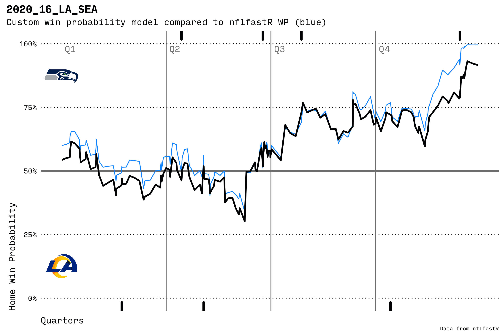

# NFL In Game Win Probability Model

An experiment to build a play by play win probability model.

Inspired by a [win probability model article](https://medium.com/@technocat79/building-a-basic-in-game-win-probability-model-for-the-nfl-54600e57fe1c) at Medium.

## Description

Uses logistic regression to model wins at each point of the game based on the score, field position, distance to the first down, time remaining, etc.

## Chart

The chart displays the output of the model (black), the built-in nflfastR win probability model (blue), scoring events (lines at bottom), and other reference lines (50% probability, times of quarters, etc.).

## Reference

Data from:

- [nflfastR](https://www.nflfastr.com/index.html)
